# AGENTIC.md — candidate agent architectures

Every box ends in a number, not an opinion. All comparisons are paired IC (t-stat) on identical rows, tradeable universe, after the [[NEGATIVE_RESULT|memorisation probe]]. Diagrams only; prose kept to one evidence line per architecture.

---

## Famous Investor Agents

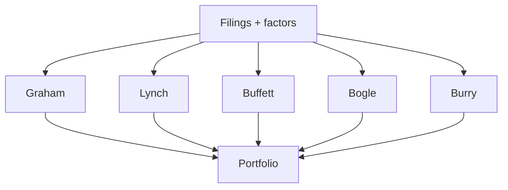
- Graham: deep value, margin of safety
- Lynch: growth at reasonable price
- Buffett: quality moat, owner earnings
- Bogle: low-cost, broad diversification
- Burry: contrarian, balance-sheet stress

## N Agents

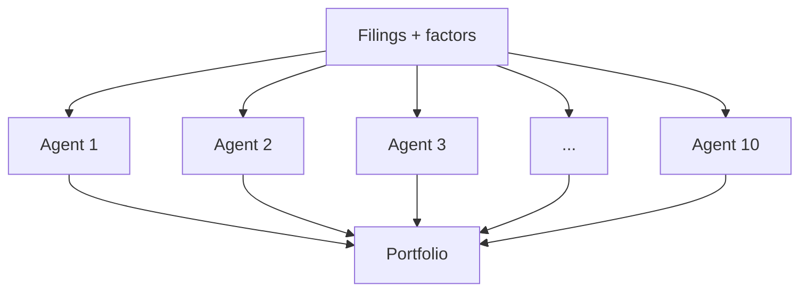
- Agents can either all use the same model or each use a different one

## Information-partitioned desks + deterministic PM

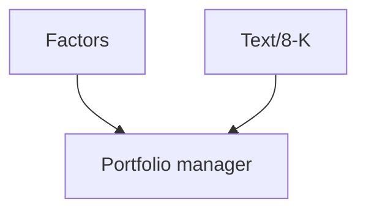
- Portfolio manager is deterministic
- Disagreement between desks can be used as a sizing dial

## Prosecutor / defense / judge (short trial)

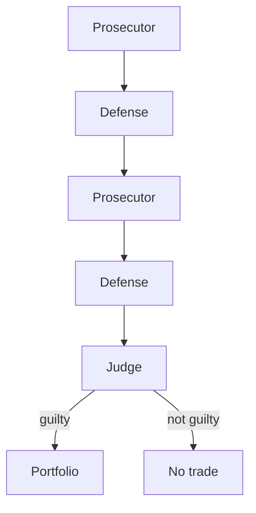
- Round 1: Prosecutor accuses (why this stock fails), Defense defends (the stock's well-being)
- Round 2: Prosecutor and Defense each rebut once more
- Judge is deterministic: guilty if days-to-cover > X or residual IC < 0
- Guilty → short enters the Portfolio ("prison"); not guilty → acquitted, no trade

## Memorisation-probe gate

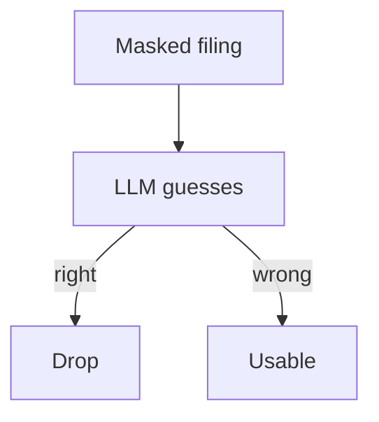
- LLM tries to guess the company + date from the masked filing
- Guesses right → drop / down-weight (recall, not forecasting)
- Can't guess → usable for forecast

## Cost-aware triage cascade

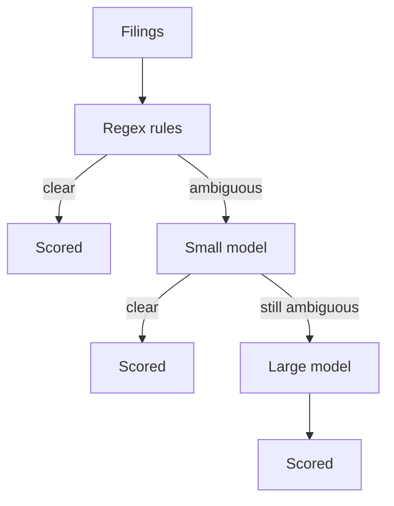
- 373k filings enter through regex rules (item code, keyword match)
- Clear cases scored cheaply and directly
- Ambiguous cases go to a small local model, then a large model only for the remaining top few %

## FACTORS.md-sectioned desks

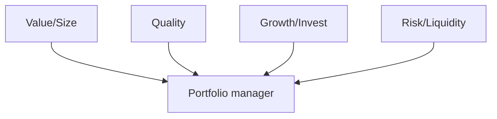
- Value/Size desk: FACTORS.md §1,2
- Quality desk: §7,10-13
- Growth/Invest desk: §3,8,9
- Risk/Liquidity desk: §14-16

## Material triage then cost triage

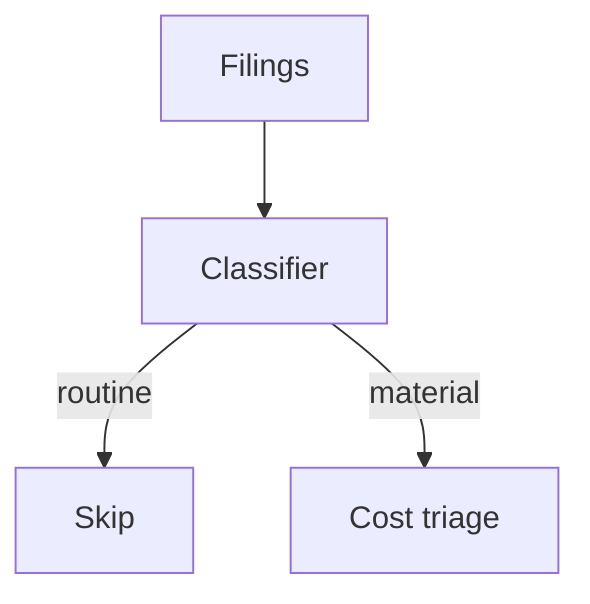
- Classifier: item-code / materiality regex (e.g. dividend decl. = routine, auditor resignation / 5.02 = material)
- Routine → scored 0, no LLM call
- Material → scored by the cost-aware triage cascade

## Single-agent collapse test

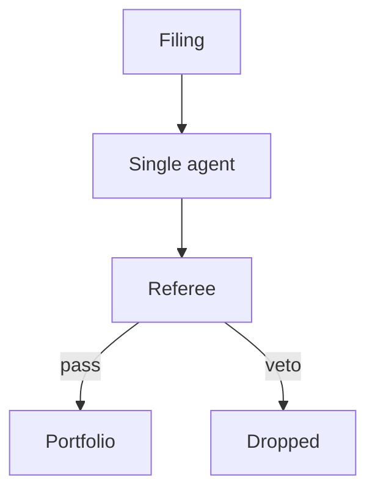
- Single agent: one prompt, one call — thesis → self-critique → verdict
- Referee is a deterministic rule, not an LLM

## Analyst-agent score as a 19th factor

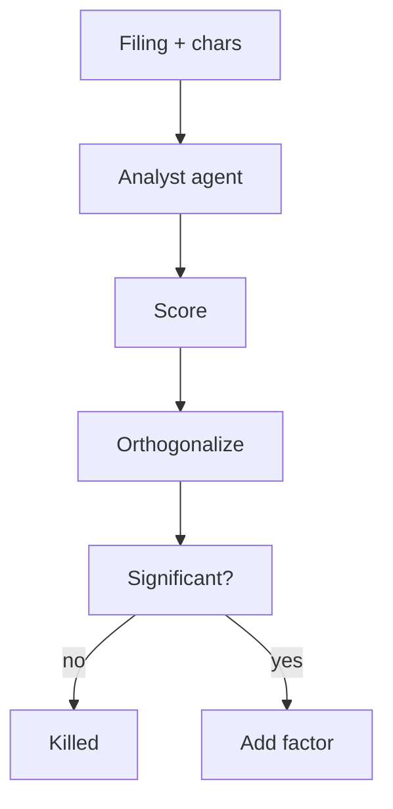
- Analyst agent: FIAM §9 use case, outputs a signed conviction score
- Orthogonalize the score vs. the 18-factor composite
- No significant residual IC → killed (same bar as any feat_* block)
- Significant residual IC → add as 19th factor, judged like composite_overlap

## FIAM's own reference architecture

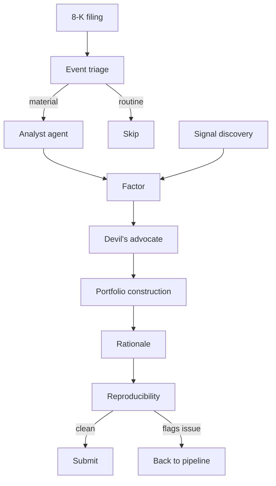
- Event-triage agent: routine (e.g. dividend decl.) vs. material (e.g. auditor resignation) — only material filings reach the analyst
- Analyst agent: ticker + 8-Ks + char history → structured verdict (what happened, expected?, signed conviction)
- Signal-discovery agent proposes/codes/backtests 147-characteristic combos; multiple-testing discipline is the team's responsibility
- Devil's-advocate agent attacks the thesis: disconfirming filings, crowding, factor exposures that explain the alpha away
- Portfolio-construction agent: forecasts → positions (100-500 names, 200% gross, ±50% net, turnover budget, sector limits)
- Rationale: writes down why each trade was made (explainability is a deliverable)
- Reproducibility agent re-runs the pipeline hunting for look-ahead bias, survivorship, leakage — clean → submission, flags issue → back into pipeline
