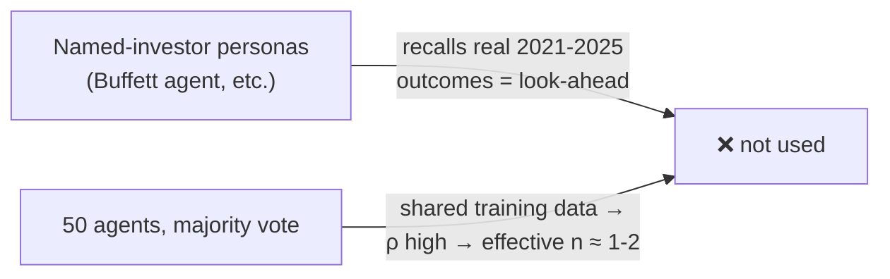
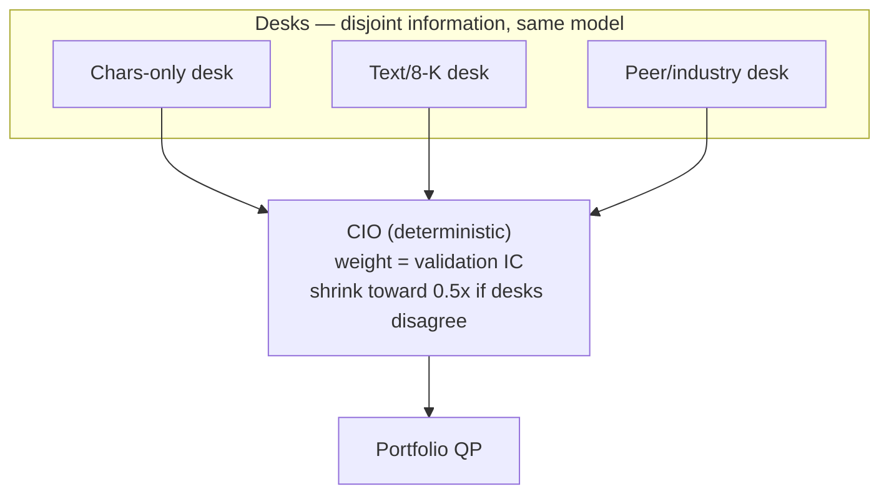
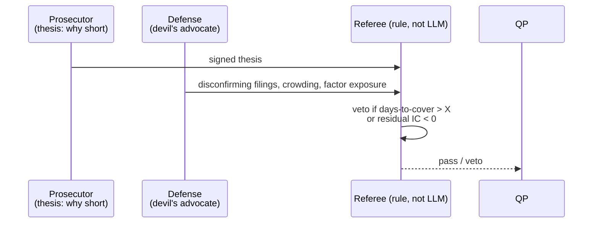
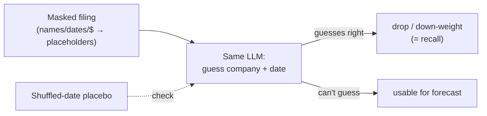
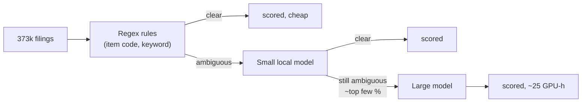
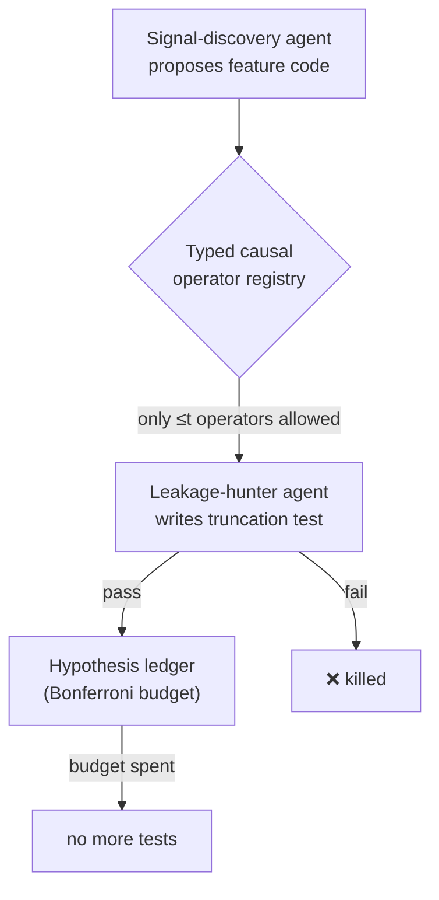
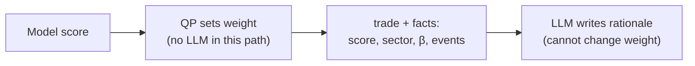
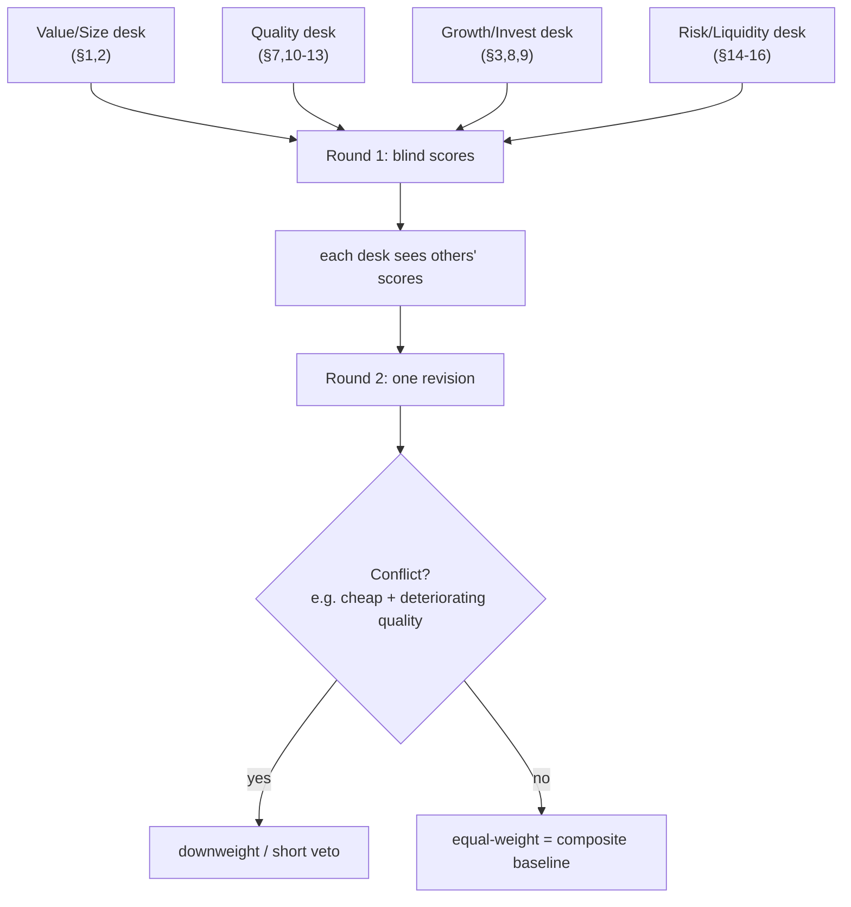
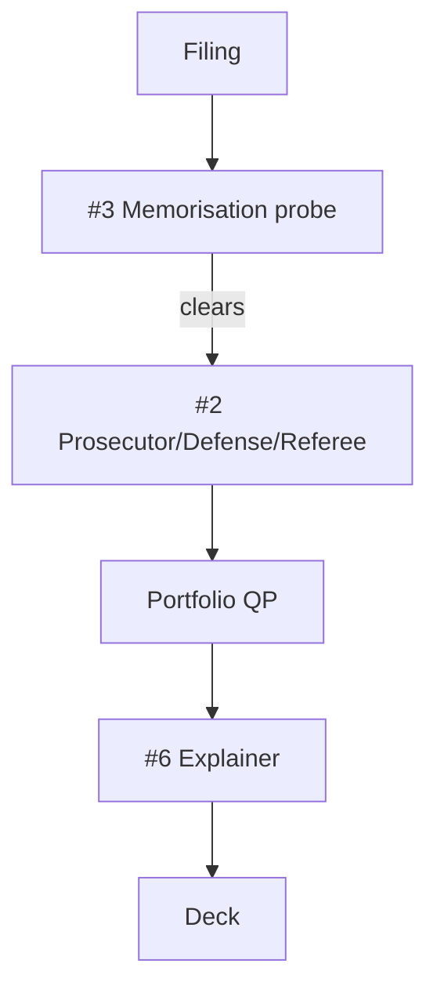
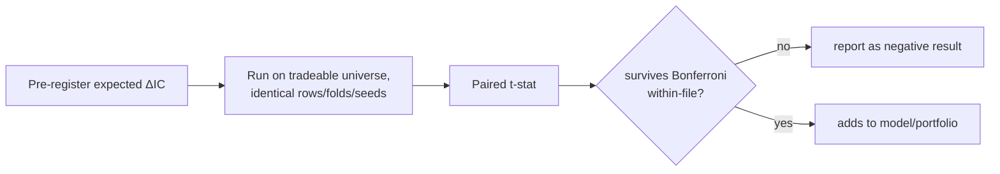

# AGENTIC.md — candidate agent architectures

Every box ends in a number, not an opinion. All comparisons are paired IC (t-stat) on identical rows, tradeable universe, after the [[NEGATIVE_RESULT|memorisation probe]]. Diagrams only; prose kept to one evidence line per architecture.

---

## 0. Rejected

Evidence: FIAM §10 look-ahead rule; docs N31/tree-ensemble equal-weight never beat best member.

---

## 1. Information-partitioned desks + rule-based CIO

Evidence: N31 diverse-feature ensembles = best member, not better; disagreement→sizing is untested, cheap.

---

## 2. Prosecutor / defense / referee (short veto)

Evidence: FIAM §9 devil's-advocate role; days-to-cover the one block that passed (t 2.67, SI>10% filter halved max DD).

---

## 3. Memorisation-probe gate

Evidence: FIAM §10 — "teams that cannot explain how they ruled out model-side look-ahead will be treated as having used it."

---

## 4. Cost-aware triage cascade

Evidence: full-corpus LLM ≈ 620-930 GPU-h vs D72's 25 GPU-h partial block.

---

## 5. Auditor guild (signal discovery, policed)

Evidence: IDEA_STATUS.md §3 — ≈185 variants tested project-wide; days-to-cover's p rises 0.015→0.23 after correction.

---

## 6. Explainer-only (math decides, LLM narrates)

Evidence: FIAM §9 — "explainability is a deliverable"; keeps LLM off the number that's graded.

---

## 7. FACTORS.md-sectioned desks + Delphi collaboration

Evidence: composite_overlap Shapley — value ≈54% of composite IC, liquidity/surprise ≈0; ridge meta-model over desks overfit (IC −0.0025); IC-weighted groups worse (−0.0126).

---

## Recommended near-term stack

Fits the 28 Sept freeze: touches only ~150 candidate names/month, reuses the existing masked extractor, each arm gets a pre-registered ΔIC/t-stat before it's trusted.

---

## Test protocol (applies to every architecture above)

